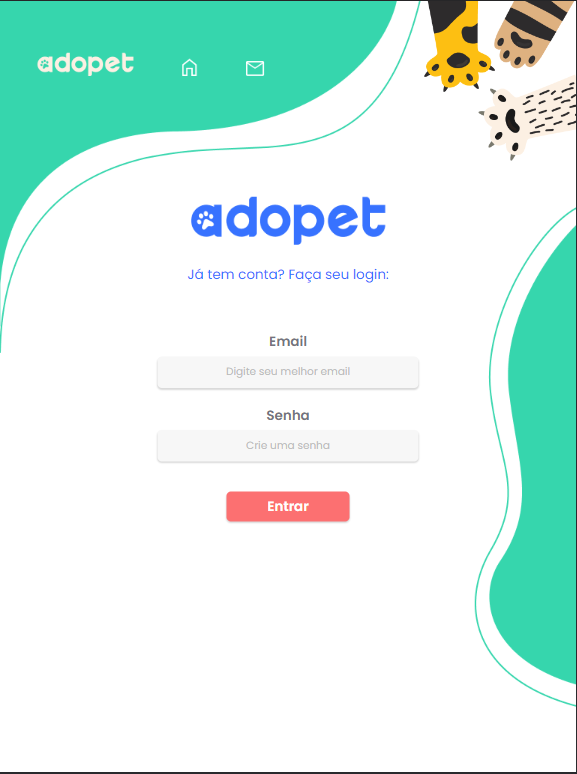
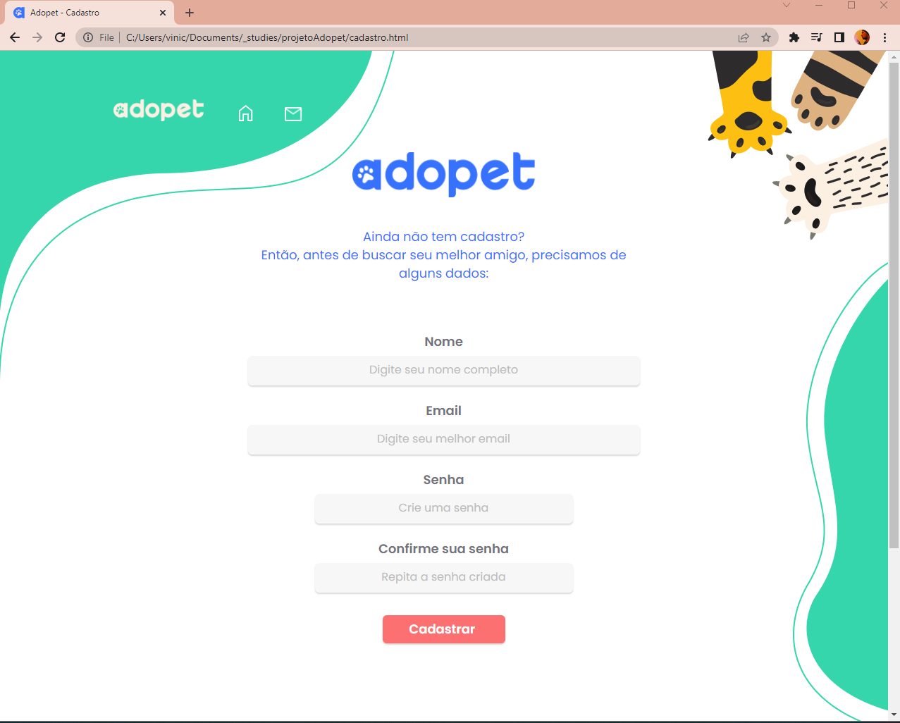

<figure align="center"></figure>

# Projeto Adopet - [Challenge Front-End 4 Alura](https://www.alura.com.br/challenges/front-end-4)

## Conteúdos

1. [Descrição do Projeto](#id-section1)
2. [Status e Versões](#id-section2)
3. [Demonstração da aplicação](#id-section3)
4. [Tecnologias Utilizadas](#id-section4)
5. [Autor](#Autor)
---

<h2 style="color: #FD8AFF">Descrição do Projeto</h2>

> A empresa AdoPet têm como objetivo fazer o intermédio entre adotantes de animais e ONGs que possuem foco de retirar animais da rua. Visando isso, ela precisa trazer mais usuários e aumentar a interação entre possíveis adotantes e representantes dessas ONGs e para isso, deseja implementar uma plataforma e levar a empresa pro mundo digital.

Projeto idealizado pela Alura no 4º Challenge Front-End

---

<h2 style="color: #FD8AFF">Status e Versões</h2>

**Status == Deploy v2.2**

<h3 style="color: pink">Primeira Versão</h3> 

Comecei a estudar mais profudamente HTML e CSS neste challenge já buscando implementar uma solução em uma aplicação.

A primeira versão, fiz as páginas todas estáticas.

**Avanço** - Entendi mais sobre o encaixe dos elementos numa página estática

**Preciso evoluir** 
- Criar páginas dinâmicas e aplicar as melhores práticas do html e css no projeto.
---

<h3 style="color: pink">Segunda Versão</h3>

A segunda versão foquei em re utilizar mais estilos, e em entender a questão da responsividade com as medias queries. Mas entendo que preciso entender mais as ==boas práticas de nomenclatura de classes css==, uso de estilos através do ==@import==.

**Avanço** - Entendi sobre a questão da responsividade entre desktop, tablet e mobile com media queries.

**Preciso evoluir** 
- Aprender React ou Angular e construir o projeto baseado no framework
    - Meu foco é implantar os projetos futuros em front-end com React e já implantar também backend simples com NodeJS com CRUD.
---

<h2 style="color: #FD8AFF">Demonstração da aplicação</h2>

#### Mobile

#### Tablet

#### Desktop

---

<h2 style="color: #FD8AFF">Tecnologias Utilizadas</h2>

---

<h2 style="color: #FD8AFF">Autor</h2>

<a style="text-decoration: none" href="https://www.linkedin.com/in/vin%C3%ADcius-sineza-1bba3b28/">[Vinicius Sineza]</a>
